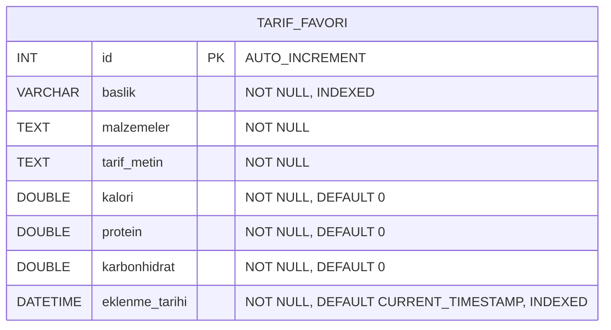

# ER (ENTITY RELATIONSHIP) DİYAGRAMI

**Proje Adı:** Yemek Tarifi Öneri Uygulaması  
**Tarih:** 2025-01-XX  
**Veritabanı:** MySQL

---

## 1. ER DİYAGRAMI

### 1.1 Mermaid Formatında ER Diyagramı



### 1.2 Görsel ER Diyagramı (Tablo Yapısı)

```
┌─────────────────────────────────────────────────────────────┐
│                    TARIF_FAVORI                              │
├─────────────────────────────────────────────────────────────┤
│ PK │ id                    │ INT          │ AUTO_INCREMENT  │
├────┼───────────────────────┼──────────────┼─────────────────┤
│    │ baslik                │ VARCHAR(255) │ NOT NULL, INDEX │
│    │ malzemeler            │ TEXT         │ NOT NULL        │
│    │ tarif_metin           │ TEXT         │ NOT NULL        │
│    │ kalori                │ DOUBLE       │ NOT NULL, >= 0  │
│    │ protein               │ DOUBLE       │ NOT NULL, >= 0  │
│    │ karbonhidrat          │ DOUBLE       │ NOT NULL, >= 0  │
│    │ eklenme_tarihi        │ DATETIME     │ NOT NULL, INDEX │
└─────────────────────────────────────────────────────────────┘
```

---

## 2. TABLO DETAYLARI

### 2.1 TARIF_FAVORI Tablosu

#### Alan Tanımları

| Alan Adı | Veri Tipi | Null | Varsayılan | Açıklama | İndeks |
|----------|-----------|------|------------|----------|--------|
| `id` | INT | NO | AUTO_INCREMENT | Birincil anahtar (Primary Key) | PRIMARY KEY |
| `baslik` | VARCHAR(255) | NO | - | Tarif başlığı/adı | INDEX (idx_baslik) |
| `malzemeler` | TEXT | NO | - | Tarif için gerekli malzemeler listesi | - |
| `tarif_metin` | TEXT | NO | - | Tarifin yapılış adımları | - |
| `kalori` | DOUBLE | NO | 0 | Kalori değeri (kcal) | - |
| `protein` | DOUBLE | NO | 0 | Protein değeri (gram) | - |
| `karbonhidrat` | DOUBLE | NO | 0 | Karbonhidrat değeri (gram) | - |
| `eklenme_tarihi` | DATETIME | NO | CURRENT_TIMESTAMP | Kayıt eklenme tarihi | INDEX (idx_eklenme_tarihi) |

#### Kısıtlamalar

- **Primary Key:** `id` alanı birincil anahtardır ve otomatik artar
- **Unique Constraint:** `baslik` alanı uygulama seviyesinde benzersiz olmalıdır (veritabanı seviyesinde unique constraint yok, uygulama kontrolü yapılıyor)
- **Check Constraint:** Besin değerleri (kalori, protein, karbonhidrat) negatif olamaz (uygulama seviyesinde kontrol edilir)
- **Index:** `baslik` ve `eklenme_tarihi` alanları üzerinde indeksler mevcuttur

---

## 3. İLİŞKİLER

### 3.1 Mevcut İlişkiler

Şu an için sistemde **tek bir tablo** bulunmaktadır. Bu nedenle tablolar arası ilişki (foreign key) yoktur.

### 3.2 Gelecek Genişletmeler

Sistem genişletildiğinde aşağıdaki tablolar ve ilişkiler eklenebilir:

```
┌─────────────────┐         ┌──────────────────┐
│    KULLANICI    │         │   TARIF_FAVORI   │
├─────────────────┤         ├──────────────────┤
│ PK id           │◄────────┤ FK kullanici_id  │
│ kullanici_adi   │   1:N   │ PK id            │
│ email           │         │ baslik           │
│ sifre           │         │ ...             │
└─────────────────┘         └──────────────────┘

┌─────────────────┐         ┌──────────────────┐
│    KATEGORI     │         │   TARIF_FAVORI   │
├─────────────────┤         ├──────────────────┤
│ PK id           │◄────────┤ FK kategori_id   │
│ kategori_adi    │   N:1   │ PK id            │
│ aciklama        │         │ baslik           │
└─────────────────┘         └──────────────────┘
```

---

## 4. VERİ MODELİ

### 4.1 Entity (Varlık)

**TARIF_FAVORI**
- **Açıklama:** Kullanıcıların favori tariflerini saklayan ana varlık
- **Özellikler:** 8 alan
- **İlişkiler:** Şu an için yok (gelecekte KULLANICI ve KATEGORI ile ilişkilendirilebilir)

### 4.2 Özellikler (Attributes)

| Özellik | Tip | Açıklama |
|---------|-----|----------|
| id | Identifier | Birincil anahtar, otomatik artan |
| baslik | Descriptive | Tarif adı, arama için indekslenmiş |
| malzemeler | Descriptive | Malzeme listesi, TEXT tipi |
| tarif_metin | Descriptive | Yapılış adımları, TEXT tipi |
| kalori | Quantitative | Besin değeri, sayısal |
| protein | Quantitative | Besin değeri, sayısal |
| karbonhidrat | Quantitative | Besin değeri, sayısal |
| eklenme_tarihi | Temporal | Kayıt tarihi, sıralama için indekslenmiş |

---

## 5. NORMALİZASYON

### 5.1 Normalizasyon Seviyesi

**3NF (Third Normal Form)** - Üçüncü normal form seviyesinde

### 5.2 Normalizasyon Analizi

- **1NF (First Normal Form):** ✅ Her alan atomik değerler içerir
- **2NF (Second Normal Form):** ✅ Tüm alanlar primary key'e tam bağımlı
- **3NF (Third Normal Form):** ✅ Transitive dependency yok

### 5.3 Normalizasyon Gerekçesi

- Tek tablo olduğu için normalizasyon sorunları yok
- Tüm alanlar `id` primary key'ine bağımlı
- Tekrarlanan veri yok
- Transitive dependency yok

---

## 6. İNDEKS STRATEJİSİ

### 6.1 Mevcut İndeksler

| İndeks Adı | Alan | Tip | Amaç |
|------------|------|-----|------|
| PRIMARY | id | Primary Key | Benzersiz tanımlayıcı |
| idx_baslik | baslik | Index | Arama performansı |
| idx_eklenme_tarihi | eklenme_tarihi | Index | Tarih sıralaması |

### 6.2 İndeks Performans Analizi

- **idx_baslik:** Tarif arama işlemlerinde kullanılır
- **idx_eklenme_tarihi:** En yeni tarifleri getirirken kullanılır
- **PRIMARY KEY:** Tüm sorgularda otomatik kullanılır

---

## 7. VERİ BÜTÜNLÜĞÜ

### 7.1 Referential Integrity

Şu an için foreign key yok, bu nedenle referential integrity kontrolü yok.

### 7.2 Domain Integrity

- **Veri Tipleri:** Her alan uygun veri tipinde tanımlanmış
- **NOT NULL:** Zorunlu alanlar NOT NULL olarak işaretlenmiş
- **DEFAULT Değerler:** Besin değerleri için 0, tarih için CURRENT_TIMESTAMP

### 7.3 Entity Integrity

- **Primary Key:** `id` alanı primary key olarak tanımlanmış
- **AUTO_INCREMENT:** Otomatik artan değer garantisi

---

## 8. VERİTABANI ŞEMA SQL

```sql
CREATE TABLE IF NOT EXISTS `tarif_favori` (
  `id` INT AUTO_INCREMENT PRIMARY KEY COMMENT 'Birincil anahtar',
  `baslik` VARCHAR(255) NOT NULL COMMENT 'Tarif başlığı/adı',
  `malzemeler` TEXT NOT NULL COMMENT 'Tarif için gerekli malzemeler listesi',
  `tarif_metin` TEXT NOT NULL COMMENT 'Tarifin yapılış adımları',
  `kalori` DOUBLE NOT NULL DEFAULT 0 COMMENT 'Kalori değeri (kcal)',
  `protein` DOUBLE NOT NULL DEFAULT 0 COMMENT 'Protein değeri (gram)',
  `karbonhidrat` DOUBLE NOT NULL DEFAULT 0 COMMENT 'Karbonhidrat değeri (gram)',
  `eklenme_tarihi` DATETIME NOT NULL DEFAULT CURRENT_TIMESTAMP COMMENT 'Kayıt eklenme tarihi',
  
  -- İndeksler
  INDEX `idx_baslik` (`baslik`),
  INDEX `idx_eklenme_tarihi` (`eklenme_tarihi`)
) ENGINE=InnoDB DEFAULT CHARSET=utf8mb4 COLLATE=utf8mb4_unicode_ci COMMENT='Favori tarifler tablosu';
```

---

## 9. ER DİYAGRAMI ARAÇLARI

Bu ER diyagramı aşağıdaki araçlarla oluşturulabilir:

- **MySQL Workbench:** Veritabanı modelleme ve ER diyagram oluşturma
- **Draw.io:** Görsel ER diyagram editörü
- **dbdiagram.io:** Online ER diyagram oluşturma
- **Lucidchart:** Profesyonel ER diyagram araçları
- **Mermaid:** Markdown içinde ER diyagram oluşturma

---

## 10. SONUÇ

### 10.1 Özet

- **Tablo Sayısı:** 1 (tarif_favori)
- **Alan Sayısı:** 8
- **İndeks Sayısı:** 3 (1 Primary Key + 2 Index)
- **İlişki Sayısı:** 0 (şu an için)
- **Normalizasyon Seviyesi:** 3NF

### 10.2 Değerlendirme

Veritabanı yapısı basit ve etkilidir. Tek tablo yapısı mevcut gereksinimleri karşılamaktadır. Gelecekte çoklu kullanıcı desteği eklendiğinde KULLANICI tablosu ve foreign key ilişkileri eklenebilir.

---

**Hazırlama Tarihi:** 2025-01-XX  
**Versiyon:** 1.0

