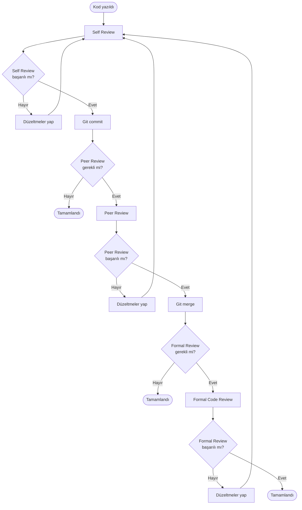

# KOD GÖZDEN GEÇİRME SÜRECİ

**Proje Adı:** Yemek Tarifi Öneri Uygulaması  
**Tarih:** 2025-01-XX

---

## 1. GÖZDEN GEÇİRME SÜRECİNİN DÜZENLENMESİ

### 1.1 Amaç

Kod gözden geçirme süreci, yazılım kalitesini artırmak, hataları erken tespit etmek ve kod standartlarına uygunluğu sağlamak için düzenlenmiştir.

### 1.2 Gözden Geçirme Türleri

#### 1.2.1 Self Review (Kendi Kendine İnceleme)

- **Amaç:** Geliştiricinin kendi kodunu incelemesi
- **Süre:** Her kod değişikliğinden sonra
- **Sorumlu:** Geliştirici

#### 1.2.2 Peer Review (Eş İnceleme)

- **Amaç:** Başka bir geliştiricinin kodunu incelemesi
- **Süre:** Önemli değişikliklerden sonra
- **Sorumlu:** Proje ekibi (varsa)

#### 1.2.3 Formal Code Review (Resmi Kod İncelemesi)

- **Amaç:** Kritik modüllerin detaylı incelenmesi
- **Süre:** Her sprint sonunda veya önemli milestone'larda
- **Sorumlu:** Teknik lider veya deneyimli geliştirici

### 1.3 Gözden Geçirme Süreci Adımları



### 1.4 Gözden Geçirme Kriterleri

#### 1.4.1 Zorunlu Kontroller

- ✅ Kod derleniyor mu?
- ✅ Syntax hataları var mı?
- ✅ OOP prensipleri uygulanmış mı?
- ✅ Exception handling doğru mu?
- ✅ XML documentation comments var mı?

#### 1.4.2 Önerilen Kontroller

- ⚠️ Kod tekrarı var mı?
- ⚠️ Metod karmaşıklığı uygun mu?
- ⚠️ Performans optimizasyonu gerekli mi?
- ⚠️ Güvenlik açıkları var mı?

---

## 2. GÖZDEN GEÇİRME SIRASINDA KULLANILACAK SORULAR

### 2.1 ÖBEK ARAYÜZÜ (Module Interface)

#### 2.1.1 Sorular

| # | Soru | Açıklama | Kontrol |
|---|------|----------|---------|
| 1 | Sınıf/Interface isimlendirmesi uygun mu? | İsimlendirme anlamlı ve açıklayıcı olmalı | ✅ |
| 2 | Public metodlar doğru tanımlanmış mı? | Gereksiz public metodlar olmamalı | ✅ |
| 3 | Interface'ler doğru kullanılmış mı? | Polymorphism için interface kullanımı | ✅ |
| 4 | Dependency Injection uygulanmış mı? | Constructor injection kullanılıyor mu? | ✅ |
| 5 | Parametreler uygun mu? | Parametre sayısı ve tipleri doğru mu? | ✅ |
| 6 | Return tipleri uygun mu? | Return tipleri açık ve anlamlı mı? | ✅ |
| 7 | Exception'lar dokümante edilmiş mi? | XML comments'te exception'lar belirtilmiş mi? | ✅ |

#### 2.1.2 Örnek Kontrol

**İyi Örnek:**
```csharp
/// <summary>
/// Yeni bir tarifi tüm besin değerleriyle favorilere ekler.
/// </summary>
/// <param name="tarif">Eklenecek tarif bilgileri</param>
/// <exception cref="System.ArgumentNullException">Tarif null ise fırlatılır</exception>
public void FavoriEkle(TarifResponse tarif);
```

**Kötü Örnek:**
```csharp
public void Add(TarifResponse t); // İsimlendirme ve dokümantasyon eksik
```

---

### 2.2 GİRİŞ AÇIKLAMALARI (Input Documentation)

#### 2.2.1 Sorular

| # | Soru | Açıklama | Kontrol |
|---|------|----------|---------|
| 1 | XML documentation comments var mı? | Tüm public üyelere `<summary>` eklenmiş mi? | ✅ |
| 2 | Parametreler dokümante edilmiş mi? | `<param>` tag'leri kullanılmış mı? | ✅ |
| 3 | Return değerleri dokümante edilmiş mi? | `<returns>` tag'leri kullanılmış mı? | ✅ |
| 4 | Exception'lar dokümante edilmiş mi? | `<exception>` tag'leri kullanılmış mı? | ✅ |
| 5 | Örnek kullanım var mı? | `<example>` tag'leri eklenmiş mi? | ⚠️ |
| 6 | Açıklamalar anlaşılır mı? | Dokümantasyon net ve açıklayıcı mı? | ✅ |

#### 2.2.2 Örnek Kontrol

**İyi Örnek:**
```csharp
/// <summary>
/// Verilen malzemelere göre AI kullanarak tarif önerisi alır.
/// IAiAsistan interface'inden gelen metodu implement eder.
/// </summary>
/// <param name="malzemeListesi">Kullanılabilir malzemelerin listesi</param>
/// <param name="imagePath">Opsiyonel: Malzeme fotoğrafının dosya yolu</param>
/// <returns>Önerilen tarif bilgileri. Null dönmez, hata durumunda exception fırlatır.</returns>
/// <exception cref="System.Exception">API hatası veya geçersiz yanıt durumunda fırlatılır</exception>
public async Task<TarifResponse> GetTarifOnerisi(string malzemeListesi, string imagePath = null);
```

**Kötü Örnek:**
```csharp
public async Task<TarifResponse> GetTarifOnerisi(string malzemeListesi, string imagePath = null);
// Dokümantasyon yok
```

---

### 2.3 VERİ KULLANIMI (Data Usage)

#### 2.3.1 Sorular

| # | Soru | Açıklama | Kontrol |
|---|------|----------|---------|
| 1 | Null kontrolü yapılmış mı? | Parametreler ve dönüş değerleri null kontrol edilmiş mi? | ✅ |
| 2 | Veri doğrulama yapılmış mı? | Input validation uygulanmış mı? | ✅ |
| 3 | Veri tipleri uygun mu? | Doğru veri tipleri kullanılmış mı? | ✅ |
| 4 | Veri güvenliği sağlanmış mı? | SQL injection, XSS gibi güvenlik açıkları var mı? | ✅ |
| 5 | Veritabanı bağlantıları doğru kapatılmış mı? | `using` statement kullanılmış mı? | ✅ |
| 6 | Memory leak var mı? | IDisposable pattern uygulanmış mı? | ✅ |
| 7 | Exception handling doğru mu? | Try-catch blokları uygun yerlerde mi? | ✅ |

#### 2.3.2 Örnek Kontrol

**İyi Örnek:**
```csharp
public override void FavoriEkle(TarifResponse tarif)
{
    // Validation
    TarifValidator.Validate(tarif); // Null ve veri kontrolü
    
    const string sql = @"INSERT INTO tarif_favori ...";
    
    try
    {
        using (var conn = new MySqlConnection(_connectionString)) // using statement
        using (var cmd = new MySqlCommand(sql, conn))
        {
            cmd.Parameters.AddWithValue("@baslik", tarif.TarifAdi); // SQL injection koruması
            // ...
            conn.Open();
            cmd.ExecuteNonQuery();
        } // Otomatik kapatma
    }
    catch (MySqlException ex)
    {
        throw new RepositoryException("...", "Insert", ex);
    }
}
```

**Kötü Örnek:**
```csharp
public void FavoriEkle(TarifResponse tarif)
{
    var conn = new MySqlConnection(_connectionString);
    var cmd = new MySqlCommand($"INSERT INTO tarif_favori VALUES ('{tarif.TarifAdi}')", conn);
    // SQL injection riski, using yok, null kontrolü yok
    conn.Open();
    cmd.ExecuteNonQuery();
    // Bağlantı kapatılmamış
}
```

---

### 2.4 ÖBEĞİN DÜZENLENİŞİ (Module Organization)

#### 2.4.1 Sorular

| # | Soru | Açıklama | Kontrol |
|---|------|----------|---------|
| 1 | Single Responsibility Principle uygulanmış mı? | Her sınıf tek bir sorumluluğa sahip mi? | ✅ |
| 2 | Kod organizasyonu uygun mu? | Klasör yapısı mantıklı mı? | ✅ |
| 3 | Kod tekrarı var mı? | DRY (Don't Repeat Yourself) prensibi uygulanmış mı? | ✅ |
| 4 | Magic numbers/strings var mı? | Sabit değerler constant olarak tanımlanmış mı? | ⚠️ |
| 5 | Metod uzunlukları uygun mu? | Metodlar çok uzun değil mi? | ✅ |
| 6 | Sınıf uzunlukları uygun mu? | Sınıflar çok büyük değil mi? | ✅ |
| 7 | Design patterns doğru kullanılmış mı? | Factory, Repository pattern vb. doğru uygulanmış mı? | ✅ |

#### 2.4.2 Örnek Kontrol

**İyi Örnek:**
```csharp
// Klasör yapısı
YemekTarifiApp/
├── Abstract/          // Abstract base classes
├── Interfaces/        // Interface definitions
├── Models/            // Data models
├── Modul/Service/     // Service implementations
├── Factory/           // Factory patterns
└── Helpers/          // Helper classes

// Single Responsibility
public static class TarifValidator
{
    public static void Validate(TarifResponse tarif) { ... }
    // Sadece validation işlemleri
}
```

**Kötü Örnek:**
```csharp
// Her şey tek bir sınıfta
public class Everything
{
    public void Validate() { ... }
    public void SaveToDatabase() { ... }
    public void CallAPI() { ... }
    public void ShowUI() { ... }
    // Çok fazla sorumluluk
}
```

---

### 2.5 SUNUŞ (Presentation)

#### 2.5.1 Sorular

| # | Soru | Açıklama | Kontrol |
|---|------|----------|---------|
| 1 | Kod formatı tutarlı mı? | Indentation, spacing tutarlı mı? | ✅ |
| 2 | İsimlendirme kuralları uygulanmış mı? | C# naming conventions uygulanmış mı? | ✅ |
| 3 | Kod okunabilirliği yüksek mi? | Kod anlaşılır ve açıklayıcı mı? | ✅ |
| 4 | Gereksiz kod var mı? | Commented out code, dead code var mı? | ✅ |
| 5 | Kod yorumları uygun mu? | Gereksiz yorumlar var mı? | ✅ |
| 6 | Değişken isimleri anlamlı mı? | `x`, `temp` gibi isimler yerine anlamlı isimler kullanılmış mı? | ✅ |

#### 2.5.2 Örnek Kontrol

**İyi Örnek:**
```csharp
/// <summary>
/// Yeni bir tarifi tüm besin değerleriyle favorilere ekler.
/// </summary>
/// <param name="tarif">Eklenecek tarif bilgileri</param>
public override void FavoriEkle(TarifResponse tarif)
{
    // Validation
    TarifValidator.Validate(tarif);
    
    const string sql = @"INSERT INTO tarif_favori 
                        (baslik, malzemeler, tarif_metin, kalori, protein, karbonhidrat, eklenme_tarihi)
                         VALUES 
                        (@baslik, @malzemeler, @tarif_metin, @kalori, @protein, @karbonhidrat, NOW());";
    
    try
    {
        using (var conn = new MySqlConnection(_connectionString))
        using (var cmd = new MySqlCommand(sql, conn))
        {
            cmd.Parameters.AddWithValue("@baslik", tarif.TarifAdi);
            // ...
            conn.Open();
            cmd.ExecuteNonQuery();
        }
    }
    catch (MySqlException ex)
    {
        throw new RepositoryException("Veritabanı hatası: Tarif eklenirken bir sorun oluştu.", "Insert", ex);
    }
}
```

**Kötü Örnek:**
```csharp
public void Add(TarifResponse t) // İsimlendirme kötü
{
    // Kod
    var x = t.TarifAdi; // Anlamsız değişken ismi
    // ...
    // Gereksiz yorumlar
    // Bu kod çalışıyor
    // Test edildi
    // ...
}
```

---

## 3. GÖZDEN GEÇİRME CHECKLIST

### 3.1 Genel Kontroller

- [ ] Kod derleniyor mu?
- [ ] Syntax hataları var mı?
- [ ] Runtime hataları var mı?
- [ ] Unit testler geçiyor mu?
- [ ] Integration testler geçiyor mu?

### 3.2 OOP Prensipleri

- [ ] Interface kullanımı var mı?
- [ ] Inheritance doğru uygulanmış mı?
- [ ] Polymorphism kullanılmış mı?
- [ ] Abstraction (abstract class) var mı?
- [ ] Encapsulation uygulanmış mı?

### 3.3 Design Patterns

- [ ] Factory Pattern kullanılmış mı?
- [ ] Repository Pattern uygulanmış mı?
- [ ] Dependency Injection uygulanmış mı?
- [ ] Strategy Pattern kullanılmış mı? (varsa)

### 3.4 Kod Kalitesi

- [ ] XML documentation comments var mı?
- [ ] Exception handling doğru mu?
- [ ] Null kontrolü yapılmış mı?
- [ ] Validation uygulanmış mı?
- [ ] Memory leak var mı?

### 3.5 Güvenlik

- [ ] SQL injection koruması var mı?
- [ ] Input validation yapılmış mı?
- [ ] Exception'lar güvenli mi? (Sensitive data expose edilmiyor mu?)

---

## 4. GÖZDEN GEÇİRME RAPORU ÖRNEĞİ

### 4.1 Rapor Formatı

```
KOD GÖZDEN GEÇİRME RAPORU
==========================

Dosya: MySqlTarifRepository.cs
Tarih: 2025-01-XX
Gözden Geçiren: [İsim]

GENEL DEĞERLENDİRME: ✅ BAŞARILI

1. ÖBEK ARAYÜZÜ: ✅
   - Interface kullanımı: ✅
   - Dependency Injection: ✅
   - Parametreler: ✅

2. GİRİŞ AÇIKLAMALARI: ✅
   - XML comments: ✅
   - Parametre dokümantasyonu: ✅
   - Exception dokümantasyonu: ✅

3. VERİ KULLANIMI: ✅
   - Null kontrolü: ✅
   - Validation: ✅
   - SQL injection koruması: ✅

4. ÖBEĞİN DÜZENLENİŞİ: ✅
   - Single Responsibility: ✅
   - Kod organizasyonu: ✅
   - Design patterns: ✅

5. SUNUŞ: ✅
   - Kod formatı: ✅
   - İsimlendirme: ✅
   - Okunabilirlik: ✅

ÖNERİLER:
- [Varsa öneriler buraya]

ONAY: ✅ ONAYLANDI
```

---

## 5. SONUÇ

### 5.1 Gözden Geçirme Süreci Özeti

- **Self Review:** Her kod değişikliğinden sonra
- **Peer Review:** Önemli değişikliklerde
- **Formal Review:** Kritik modüllerde

### 5.2 Kontrol Kriterleri

- ✅ Öbek Arayüzü
- ✅ Giriş Açıklamaları
- ✅ Veri Kullanımı
- ✅ Öbeğin Düzenlenişi
- ✅ Sunuş

### 5.3 Başarı Kriterleri

- Tüm zorunlu kontroller geçti
- OOP prensipleri uygulandı
- Kod kalitesi yüksek
- Güvenlik açıkları yok

---

**Hazırlama Tarihi:** 2025-01-XX  
**Versiyon:** 1.0

