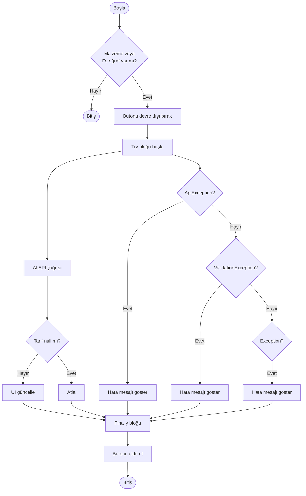
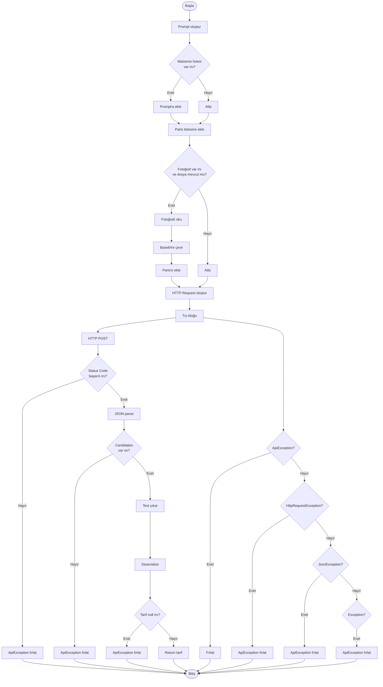
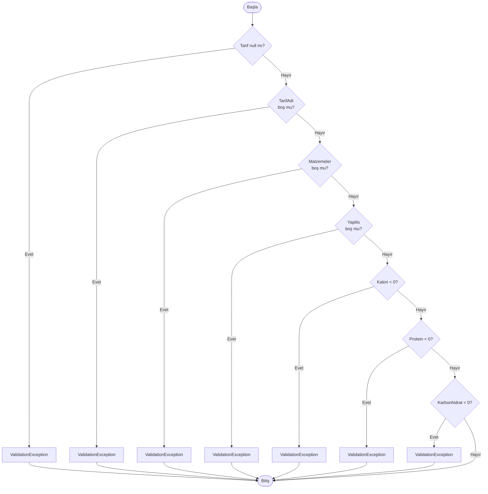
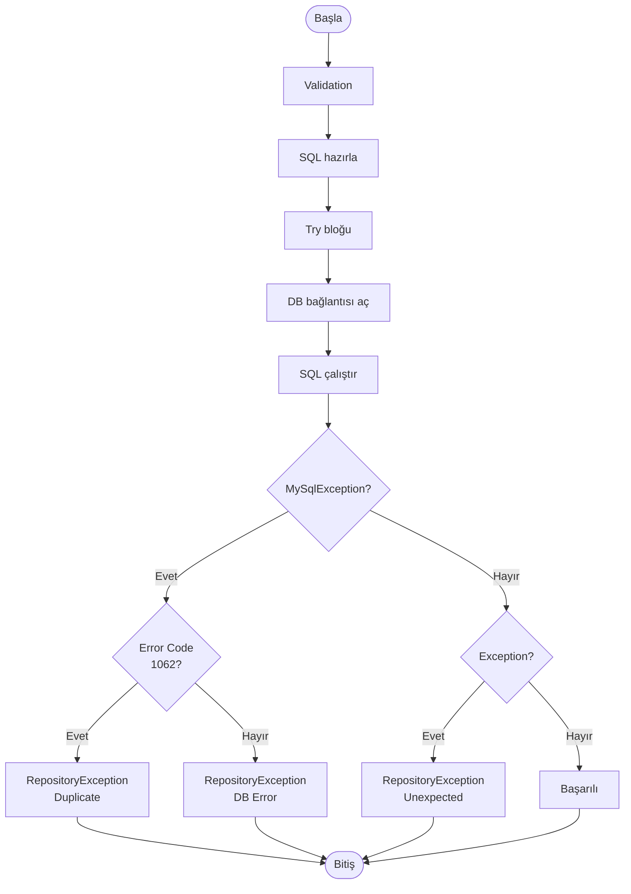

# MCCABE KARMAŞIKLIK ÖLÇÜTÜ ANALİZİ

**Proje Adı:** Yemek Tarifi Öneri Uygulaması  
**Tarih:** 2025-01-XX

---

## 1. MCCABE KARMAŞIKLIK ÖLÇÜTÜ NEDİR?

McCabe Karmaşıklık Ölçütü (Cyclomatic Complexity), bir programın kontrol akış grafiğindeki döngüsel karmaşıklığı ölçer. Bu ölçüt, bir programın test edilebilirliği ve bakım kolaylığı hakkında bilgi verir.

### 1.1 Formül

**V(G) = E - N + 2P**

- **E:** Kenar sayısı (edges) - Kontrol akışındaki ok sayısı
- **N:** Düğüm sayısı (nodes) - Kod blokları ve karar noktaları
- **P:** Bağlı bileşen sayısı (genellikle 1)

**Alternatif Formül:** V(G) = Karar Noktaları Sayısı + 1

### 1.2 Değerlendirme Kriterleri

| Karmaşıklık Değeri | Değerlendirme | Açıklama |
|-------------------|---------------|----------|
| 1-10 | Düşük | Basit, anlaşılır kod |
| 11-20 | Orta | Karmaşıklık kabul edilebilir |
| 21-30 | Yüksek | Refactoring önerilir |
| 31+ | Çok Yüksek | Mutlaka refactoring gerekli |

---

## 2. PROGRAMIN ÇİZGE BİÇİMİNE DÖNÜŞTÜRÜLMESİ

### 2.1 Kontrol Akış Grafiği Gösterimi

Kontrol akış grafiği, programın yürütme akışını gösterir:
- **Dikdörtgen:** İşlem blokları (statements)
- **Elmas:** Karar noktaları (if, while, switch)
- **Yuvarlak:** Başlangıç/Bitiş noktaları

---

## 3. METOD BAZINDA MCCABE ANALİZİ

### 3.1 AnalizBaslat() Metodu

**Sınıf:** `FrmTarifOneri`  
**Satırlar:** 167-211

#### Kontrol Akış Grafiği

#### McCabe Hesaplama

- **Karar Noktaları:** 4 (Check1, Check2, Catch1, Catch2, Catch3)
- **V(G) = 4 + 1 = 5**

**Değerlendirme:** Düşük karmaşıklık ✅

---

### 3.2 GetTarifOnerisi() Metodu

**Sınıf:** `SGeminiAsistan`  
**Satırlar:** 49-126

#### Kontrol Akış Grafiği

#### McCabe Hesaplama

- **Karar Noktaları:** 9 (Check1, Check2, Check3, Check4, Check5, Catch1, Catch2, Catch3, Catch4)
- **V(G) = 9 + 1 = 10**

**Değerlendirme:** Düşük-Orta karmaşıklık ✅

---

### 3.3 Validate() Metodu

**Sınıf:** `TarifValidator`  
**Satırlar:** 18-40

#### Kontrol Akış Grafiği

#### McCabe Hesaplama

- **Karar Noktaları:** 7 (Check1-7)
- **V(G) = 7 + 1 = 8**

**Değerlendirme:** Düşük karmaşıklık ✅

---

### 3.4 FavoriEkle() Metodu

**Sınıf:** `MySqlTarifRepository`  
**Satırlar:** 42-93

#### Kontrol Akış Grafiği

#### McCabe Hesaplama

- **Karar Noktaları:** 3 (Check1, Check2, Check3)
- **V(G) = 3 + 1 = 4**

**Değerlendirme:** Düşük karmaşıklık ✅

---

## 4. GENEL MCCABE ANALİZİ ÖZETİ

### 4.1 Metod Karmaşıklık Tablosu

| Metod | Sınıf | McCabe Değeri | Değerlendirme |
|-------|-------|---------------|---------------|
| `AnalizBaslat()` | FrmTarifOneri | 5 | Düşük ✅ |
| `GetTarifOnerisi()` | SGeminiAsistan | 10 | Düşük-Orta ✅ |
| `Validate()` | TarifValidator | 8 | Düşük ✅ |
| `FavoriEkle()` | MySqlTarifRepository | 4 | Düşük ✅ |
| `GetTumFavoriler()` | MySqlTarifRepository | 3 | Düşük ✅ |
| `FavoriSil()` | MySqlTarifRepository | 4 | Düşük ✅ |
| `IsValidMalzemeListesi()` | TarifValidator | 1 | Düşük ✅ |
| `IsValidImageFile()` | TarifValidator | 2 | Düşük ✅ |

### 4.2 Ortalama Karmaşıklık

**Ortalama McCabe Değeri:** (5 + 10 + 8 + 4 + 3 + 4 + 1 + 2) / 8 = **4.625**

**Değerlendirme:** Proje genelinde **düşük karmaşıklık** seviyesi ✅

---

## 5. KARMAŞIKLIK DEĞERLENDİRMESİ

### 5.1 Güçlü Yönler

- ✅ Tüm metodlar düşük-orta karmaşıklık seviyesinde
- ✅ En karmaşık metod (GetTarifOnerisi) bile kabul edilebilir seviyede (10)
- ✅ Ortalama karmaşıklık çok düşük (4.625)
- ✅ Kod okunabilirliği yüksek
- ✅ Test edilebilirlik kolay

### 5.2 İyileştirme Önerileri

- `GetTarifOnerisi()` metodu 10 karmaşıklığa sahip. İyileştirme için:
  - Exception handling'i ayrı bir metoda taşınabilir
  - JSON parsing işlemi ayrı bir metoda taşınabilir
  - Bu sayede karmaşıklık 7-8 seviyesine düşürülebilir

### 5.3 Kod Kalitesi

**Genel Değerlendirme:** Proje, **düşük karmaşıklık** seviyesinde, **iyi yapılandırılmış** ve **bakımı kolay** bir kod yapısına sahiptir.

---

## 6. TEST KAPSAMI İLE İLİŞKİSİ

### 6.1 Test Senaryosu Sayısı

McCabe karmaşıklığı, bir metod için yazılması gereken minimum test sayısını gösterir:

| Metod | McCabe | Minimum Test Sayısı |
|-------|--------|---------------------|
| `AnalizBaslat()` | 5 | 5 test senaryosu |
| `GetTarifOnerisi()` | 10 | 10 test senaryosu |
| `Validate()` | 8 | 8 test senaryosu |
| `FavoriEkle()` | 4 | 4 test senaryosu |

### 6.2 Test Kapsamı Hedefi

- **Minimum Test Coverage:** McCabe değeri kadar test senaryosu
- **Hedef Test Coverage:** %80+ (tüm dallar test edilmeli)

---

## 7. SONUÇ

### 7.1 Özet

- **Toplam Analiz Edilen Metod:** 8
- **En Yüksek McCabe Değeri:** 10 (`GetTarifOnerisi`)
- **En Düşük McCabe Değeri:** 1 (`IsValidMalzemeListesi`)
- **Ortalama McCabe Değeri:** 4.625
- **Genel Değerlendirme:** Düşük karmaşıklık ✅

### 7.2 Sonuç

Proje, **McCabe karmaşıklık ölçütüne göre iyi durumdadır**. Tüm metodlar kabul edilebilir karmaşıklık seviyesindedir ve refactoring gerektirmemektedir. Kod yapısı, test edilebilirlik ve bakım kolaylığı açısından uygundur.

---

**Hazırlama Tarihi:** 2025-01-XX  
**Versiyon:** 1.0

