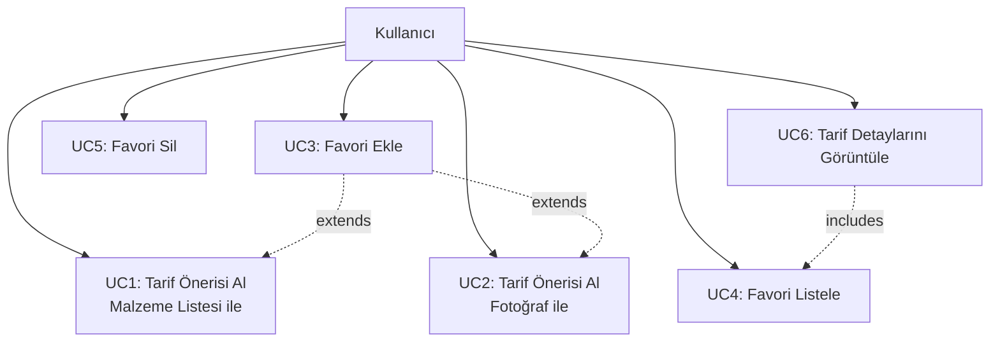
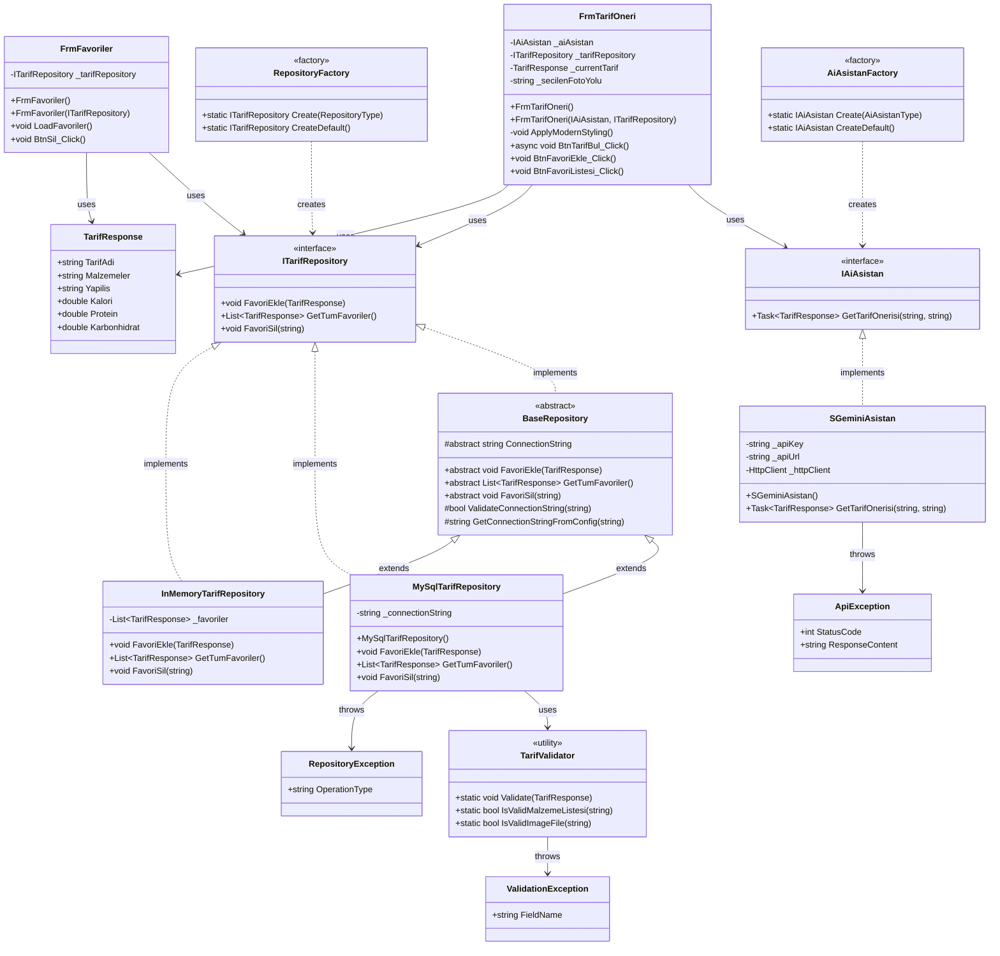
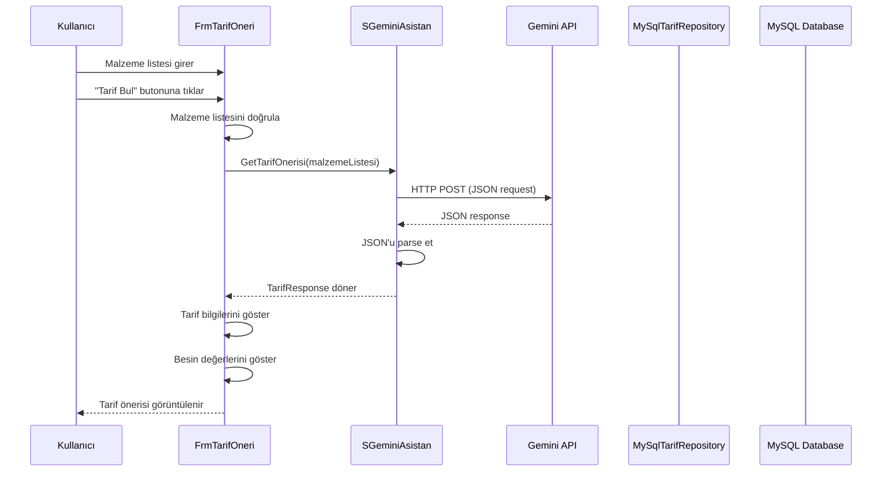
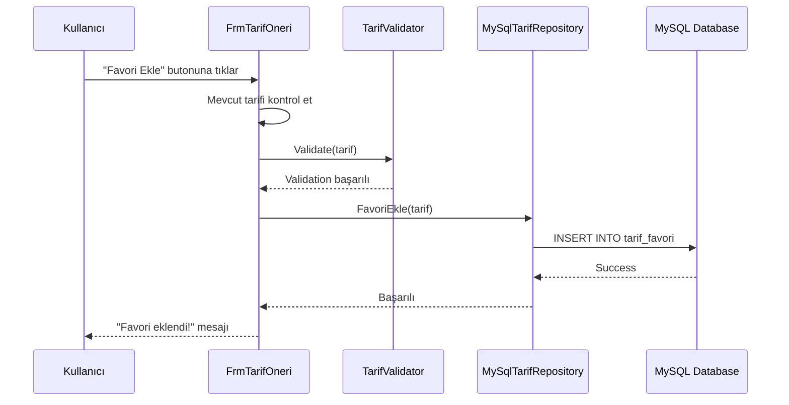
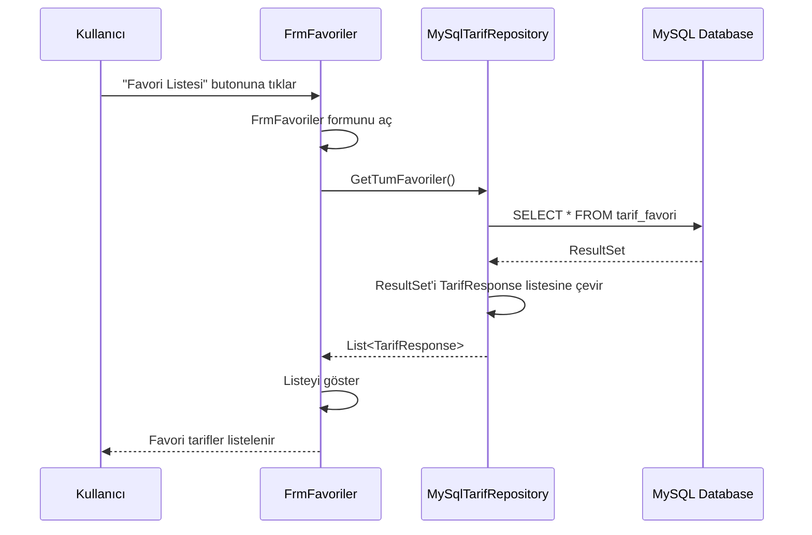
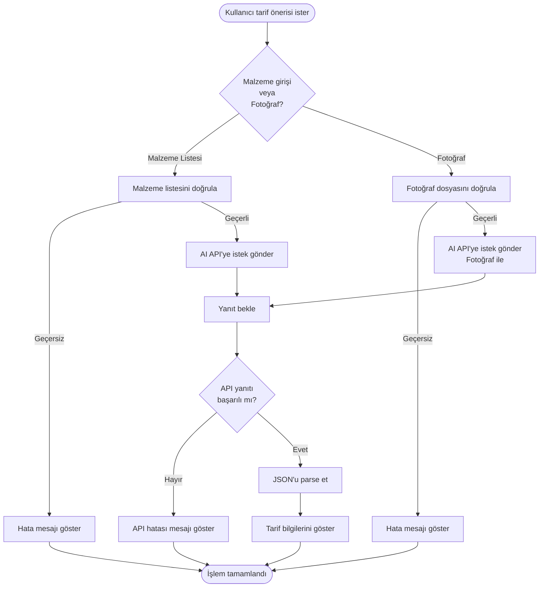
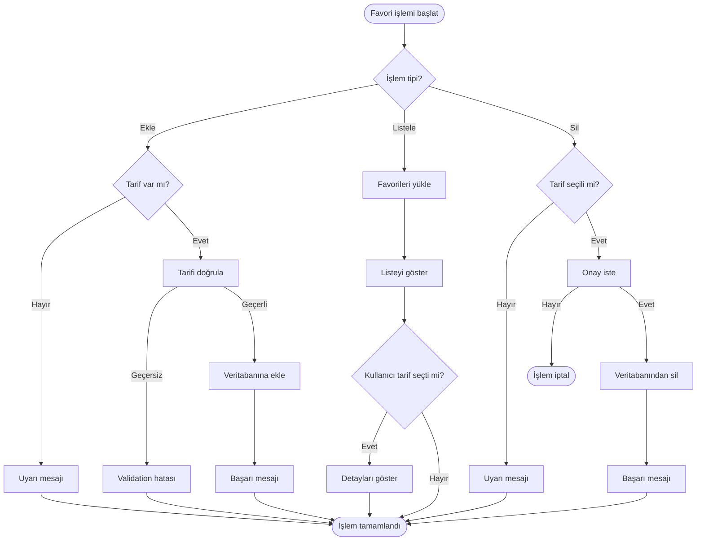

# UML DİYAGRAMLARI

**Proje Adı:** Yemek Tarifi Öneri Uygulaması  
**Tarih:** 2025-01-XX

---

## 1. USE CASE DİYAGRAMI

Use Case diyagramı, sistemin kullanıcılar tarafından gerçekleştirilebilecek işlevlerini gösterir.

### Use Case Açıklamaları

| Use Case | Açıklama |
|----------|----------|
| **UC1: Tarif Önerisi Al (Malzeme Listesi ile)** | Kullanıcı malzeme listesini yazarak AI'dan tarif önerisi alır |
| **UC2: Tarif Önerisi Al (Fotoğraf ile)** | Kullanıcı fotoğraf yükleyerek AI'dan tarif önerisi alır |
| **UC3: Favori Ekle** | Kullanıcı bir tarifi favorilerine ekler |
| **UC4: Favori Listele** | Kullanıcı favori tariflerini listeler |
| **UC5: Favori Sil** | Kullanıcı bir favori tarifi siler |
| **UC6: Tarif Detaylarını Görüntüle** | Kullanıcı bir tarifin detaylarını görüntüler |

---

## 2. SINIF DİYAGRAMI (CLASS DIAGRAM)

Sınıf diyagramı, sistemdeki sınıfları, özelliklerini ve ilişkilerini gösterir.

### Sınıf İlişkileri Açıklaması

- **Inheritance (Kalıtım):** `BaseRepository` abstract class'ından `MySqlTarifRepository` ve `InMemoryTarifRepository` türetilmiştir.
- **Interface Implementation:** `ITarifRepository` ve `IAiAsistan` interface'leri implement edilmiştir.
- **Dependency (Bağımlılık):** Formlar interface'ler üzerinden bağımlılık kullanır (Dependency Injection).
- **Composition:** `TarifResponse` model sınıfı diğer sınıflar tarafından kullanılır.
- **Factory Pattern:** `RepositoryFactory` ve `AiAsistanFactory` nesne oluşturma için kullanılır.

---

## 3. SEQUENCE DİYAGRAMI

Sequence diyagramı, sistemdeki nesneler arasındaki etkileşimleri zaman sırasına göre gösterir.

### 3.1 Tarif Önerisi Alma (Malzeme Listesi ile)

### 3.2 Favori Ekleme

### 3.3 Favori Listeleme

---

## 4. ACTIVITY DİYAGRAMI

Activity diyagramı, sistemdeki iş akışlarını gösterir.

### 4.1 Tarif Önerisi Alma Akışı

### 4.2 Favori Yönetimi Akışı

---

## 5. DİYAGRAM AÇIKLAMALARI

### 5.1 Use Case Diyagramı

- **Aktör:** Kullanıcı (tek aktör)
- **Use Case'ler:** 6 ana use case
- **İlişkiler:** Include ve Extend ilişkileri kullanılmıştır

### 5.2 Sınıf Diyagramı

- **Toplam Sınıf Sayısı:** 15+ sınıf
- **Interface Sayısı:** 2 (ITarifRepository, IAiAsistan)
- **Abstract Class:** 1 (BaseRepository)
- **Factory Pattern:** 2 factory sınıfı
- **Exception Sınıfları:** 3 custom exception

### 5.3 Sequence Diyagramı

- **3 ana akış:** Tarif önerisi alma, Favori ekleme, Favori listeleme
- **Asenkron işlemler:** AI API çağrıları async/await ile gösterilmiştir
- **Hata yönetimi:** Exception handling akışları gösterilmiştir

### 5.4 Activity Diyagramı

- **Karar noktaları:** Diamond şekilleri ile gösterilmiştir
- **Paralel işlemler:** Fork/Join gösterilmemiştir (tek akış)
- **Hata durumları:** Error handling akışları dahil edilmiştir

---

## 6. UML ARAÇLARI

Bu diyagramlar aşağıdaki araçlarla oluşturulabilir:

- **Mermaid:** Markdown içinde diyagram oluşturma
- **PlantUML:** Text-based UML diyagramları
- **Draw.io:** Görsel UML diyagram editörü
- **Visual Studio:** Class diagram özelliği
- **Enterprise Architect:** Profesyonel UML araçları

---

**Hazırlama Tarihi:** 2025-01-XX  
**Versiyon:** 1.0

